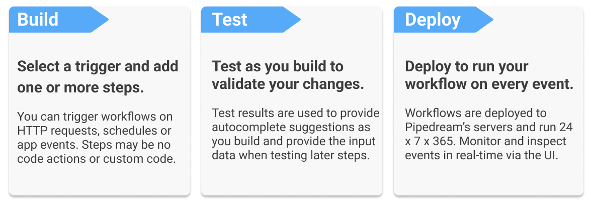

# Introduction to Pipedream

Pipedream is the fastest way to automate any process that connects APIs. Build and run workflows with code-level control when you need it, and no code when you don't. 

The Pipedream platform includes:

- A [serverless runtime](/code/) and [workflow service](/workflows/)
- Open source [triggers](/workflows/steps/triggers/) and [actions](/components/actions/) for [hundreds of integrated apps](https://pipedream.com/explore/)
- One-click [OAuth and key-based authentication](/connected-accounts/) for hundreds of APIs (use tokens directly in code or with pre-built actions)

Watch a demo or review our [quickstart guide](/quickstart/):

<video controls poster="./images/demo-poster.png" width="100%">
  <source src="https://res.cloudinary.com/pipedreamin/video/upload/v1644985143/homepage/pipedream-demo_qyvlni.mp4" type="video/mp4">
Your browser does not support the video tag.
</video>

## Getting Started

To get started, [sign up for a free account](https://pipedream.com/auth/signup) (no credit card required) and follow our [quickstart guide](/quickstart/) to create your first workflow.

One you understand the basics of workflow development, learn how to get more out of Pipedream:

- [Use code in workflows](/code/) 
- [Develop custom actions](/components/quickstart/nodejs/actions/) 
- [Develop custom triggers](/components/quickstart/nodejs/sources/)

## Use Cases

Pipedream supports use cases from prototype to production and is trusted by 200k+ developers from startups to Fortune 500 companies:

The platform processes billions of events and is built and [priced](https://pipedream.com/pricing/) for use at scale. [Our team](https://pipedream.com/about) has built internet scale applications and managed data pipelines in excess of 10 million events per second (EPS) at startups and high-growth environments like BrightRoll, Yahoo!, Affirm and Instacart. 

Our [community](https://pipedream.com/community) uses Pipedream for a wide variety of use cases including:

- Connecting SaaS apps
- General API orchestration and automation
- Database automations ([reach out](https://pipedream.com/community) to learn about connecting to resources behind a firewall)
- Custom notifications and alerting
- Mobile and JAMstack backends
- Rate limiting, request smoothing
- Event queueing and concurrency management
- Webhook inspection and routing
- Prototyping and demos

## Open Source

Pipedream maintains an [open source component registry](https://github.com/pipedreamhq/pipedream/) on GitHub so you can avoid writing boilerplate code for common API integrations. Use components as no code building blocks in workflows, or use them to scaffold code that you can customize. You can also [create a PR contribute new or enhanced components](/components/guidelines/#process) via GitHub.

## Contributing

We hope is that by providing a generous free tier, you will not only get value from Pipedream, but you will give back to help us improve the product for the entire community and grow the platform by:

- [Contributing](/components/guidelines/) open source components to our [registry](https://github.com/pipedreamhq/pipedream) or sharing via your own GitHub repo
- Asking and answering questions in our [public community](https://pipedream.com/community/)
- [Reporting bugs](https://pipedream.com/community/c/bugs/9) and [requesting features](https://github.com/PipedreamHQ/pipedream/issues/new?assignees=&labels=enhancement&template=feature_request.md&title=%5BFEATURE%5D+) that help us build a better product
- Following us on [Twitter](https://twitter.com/pipedream), starring our [GitHub repo](https://github.com/PipedreamHQ/pipedream) and subscribing to our [YouTube channel](https://www.youtube.com/c/pipedreamhq)
- Recommending us to your friends and colleagues

Learn about [all the ways you can contribute](https://pipedream.com/contributing).

## Support & Community

If you have any questions or feedback, please [reach out in our community forum](https://pipedream.com/community).

## Service Status

Pipedream operates a status page at [https://status.pipedream.com](https://status.pipedream.com). That page displays the uptime history and current status of every Pipedream service.

When incidents occur, updates are published to the **#incidents** channel of [Pipedream's Slack Community](https://pipedream.com/support) and to the [@PipedreamStatus](https://twitter.com/PipedreamStatus) account on Twitter. On the status page itself, you can also subscribe to updates directly.
