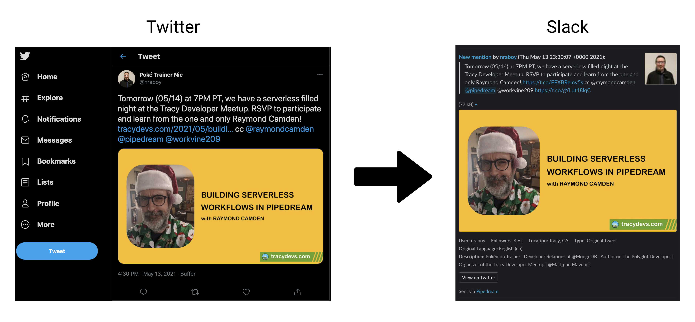

# Pipedream 101

Learn the basic patterns for developing Pipedream workflows, including how to:

- Trigger workflows on HTTP requests, schedules and app events
- Return a custom response from your workflow on HTTP requests 
- Use npm packages and export data from Node.js code steps
- Pass data between workflow steps
- Use actions to send yourself an email and add data to Google Sheets
- Use Pipedream managed auth in Node.js code steps with the Github API

The initial examples will cover basic concepts as we build up to a real-world use case to post richly formatted Tweets to Slack:

## Examples

::: tip
We **strongly** recommend that you complete the examples in order. Each section will also link to a completed workflow that you can view, copy and run.
:::

This guide will cover the following examples. 

**[hello world!](/quickstart/hello-world/) (~5 minutes)**

- Create a new workflow and learn the builder layout
- Generate a unique endpoint URL to trigger your workflow
- Send HTTP requests to your workflow and inspect them
- Add an optional custom response to return "hello world!" on each HTTP request

**[hello ${name}!](/quickstart/hello-name/) (~5 minutes)**

- Modify the first example to use data passed in GET and POST requesets.
- First, pass a name as a query parameter and return it in the response
- Next, POST a JSON payload with a name and return it in the response

**[Make outbound HTTP requests!](/quickstart/make-http-request/) (~5 minutes)**

- Use the **GET Request** action to make an HTTP request to an API endpoint
- Test and inspect the step exports 
- Update the workflow response to return data exported by the HTTP request step

**[Use npm packages](/quickstart/using-npm-packages/) (~5 minutes)**

- Replace the GET Request action with code using an npm package
- Use the `axios` npm package in a code step
- Rename the step

**[Insert data into Google Sheets](/quickstart/add-data-to-google-sheets/) (~5 minutes)**

- Create a workflow triggered on a schedule
- Use the `axios` npm package to get data from an API
- Save data returned from the API to Google Sheets

**[Use managed auth in code](/quickstart/use-managed-auth-in-code/) (~5 minutes)**

- TBC
- TBC

**[Email yourself on new items in an RSS feed](/quickstart/email-yourself/) (~5 minutes)**

- Trigger our workflow on new items in an RSS feed
- Use an action to send an email to the account registered with Pipedream

**[Real-world Twitter -> Slack](/quickstart/bringing-it-all-together/) (~5 minutes)**

- Create a workflow triggered on new Twitter mentions 
- Format the Tweet using Slack Block Kit
- Post the formatted message to a Slack channel

## What you'll need

At minimum, create a free account at [https://pipedream.com](https://pipedream.com). To complete all the examples, you'll also need accounts for:

- Google Sheets
- Github
- Slack
- Twitter
