# Quickstart: Pipedream Workflows

After completing this quickstart, you'll understand the basic patterns for developing Pipedream workflows including how to:

- Trigger workflows on HTTP requests, schedules and app events (including new items in an RSS feed and new mentions on Twitter) 
- Return a custom response from your workflow on HTTP requests 
- Use npm packages and export data from Node.js code steps
- Pass data between workflow steps
- Use actions to send yourself an email, add data to Google Sheets and send a message to Slack

## **Overview**

This guide will cover the following examples. We recommend that you complete the examples below in order. Each section will also link to a completed workflow that you can view, copy and run.

**Getting Started (~5 minutes)**

- Learn how to create a new workflow
- Understand the layout of the builder

**hello world! (~5 minutes)**

Create a basic HTTP triggered workflow.

- Generate a unique endpoint URL 
- Send HTTP requests to the URL and inspect them
- Add a custom response to return "hello world!" on each HTTP request

**hello ${name}! (~5 minutes)**

Modify the first example to use data passed in GET and POST requesets.

- First, pass a name as a query parameter and return it in the response
- Next, POST a JSON payload with a name and return it in the response

**Make an HTTP request from a workflow (~5 minutes)**

We'll modify our HTTP triggered workflow one more time to:

- Use the **GET Request** action to make an HTTP request to an API endpoint
- Test and inspect the step exports 
- Update the workflow response to return data exported by the HTTP request step

**Use an npm package (~5 minutes)**

Replace the GET Request action with code using an npm package

- Use the `axios` npm package in a code step
- Rename the step

**Email yourself on new items in an RSS feed (~5 minutes)**

This time, we'll create a new workflow.

- Trigger our workflow on new items in an RSS feed
- Use an action to send an email to the account registered with Pipedream

**Get data from an API on a schedule and add to Google Sheets (~5 minutes)**

- Create a workflow triggered on a schedule
- Use the `axios` npm package to get data from an API
- Save data returned from the API to Google Sheets

**Search Twitter and post richly formatted messages to Slack (~5 minutes)**

- Create a workflow triggered on new Twitter mentions 
- Format the Tweet using Slack Block Kit
- Post the formatted message to a Slack channel

## Prerequisites

At minimum, create a free account at [https://pipedream.com](https://pipedream.com). To complete all the examples, you'll also need accounts for:

- Google Sheets
- Slack
- Twitter 

## Walkthrough

To get started, create a Pipedream account at https://pipedream.com/. You can create an account for free — no credit card is required.

### Getting Started 

##### Create a new workflow

Create a new workflow by clicking the **New** button on https://pipedream.com/workflows:


Pipedream will launch the workfow builder:


##### Builder Layout

Following is a map and explanation of the screen layout:

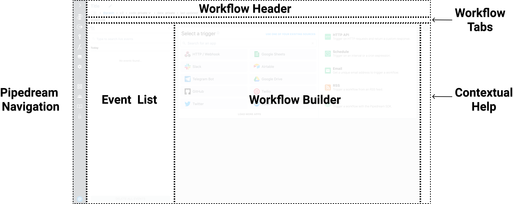

**Pipedream Navigation:** Navigate between different sections of the Pipedream app (workflows, sources, accounts, settings, etc). You can collapse and expand this section using the arrow at the top left.

**Workflow Header:** Name your workflow, view metadata and manage sharing settings.

**Event List:** Events that trigger your workflow will be listed here (both test and live events). Select events to view the results of the execution in the *Workflow Builder* section.

**Canvas**: This is the section where you will build your workflow and view execution resuts.

**Workflow Tabs**: After saving or depoying your workflow, you will be able to switch between the builder, readme and settings for your workflow.

**Contextual Help**: Expand this tab to view contextual help for the current step.

### hello world!

In this first example, we'll create an HTTP triggered workflow that will return a custom response on each HTTP request.

#### The Basics — Create an HTTP Triggered Workflow

To create an HTTP or webhook triggered workflow, select the **HTTP API** trigger. 


Your workflow will automatically deploy and Pipedream will generate a unique endpiont URL.


Any requests you make to the endpoint URL will trigger your workflow. To test it out:

1. Copy the endpoint URL generated by Pipedream (you can click to link icon to the right of the endpoint to copy to the clipboard)
2. Open a new browser tab and load the URL


When you return to your workflow, you'll see the requests appear in the event list (events appear in real-time — you don't need to refresh the page). 

>  **NOTE:** When you look at the event list, you may see multiple requests — that's because modern browsers automatically request `favicon.ico` when you load a URL.

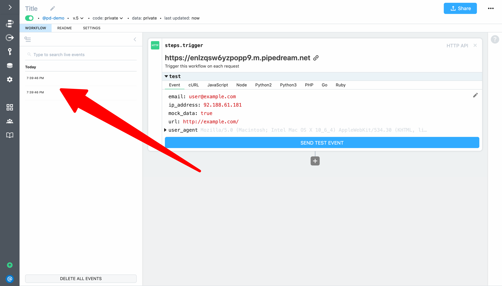

When you select an event from the list, the data associated with that event will appear below each of the steps in your workflow. For the trigger, that means details related to the inbound request (e.g., URL, HTTP method, body, headers, etc) will appear. This data can also be referenced by steps in your workflow via the `steps` object. For example, to reference the HTTP body, you would access via `steps.trigger.event.body`.

![[video-to-gif output image]](https://im2.ezgif.com/tmp/ezgif-2-a8d29ac088cc.gif)

#### Return a custom response

Let's write some simple code to return a custom response using Pipedream's `$respond()` function. First, click on **Run Node.js code** to add a code step.

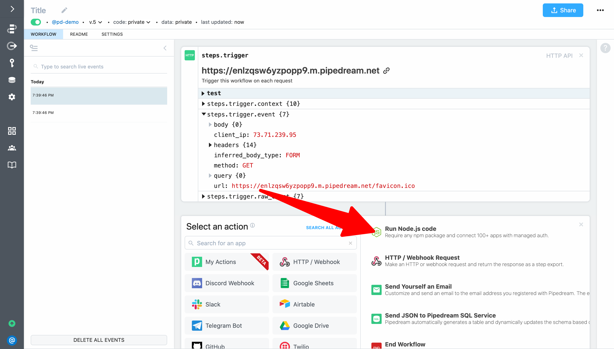 

Pipedream will add a code step to your workflow. 


You can write any Node.js and include any npm package (just `require` it — there's no `npm install` required). For this example, add the following code to return a custom response:

```javascript
await $respond({
  status: 200,
  immediate: true,
  body: "hello world!"
})
```


Then click the deploy button so your workflow changes will run in production on each new event:

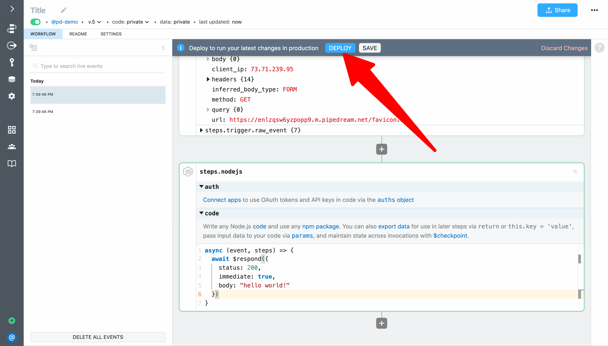

Then reload the tab where you previously loaded the endpoint URL — you the response should change to `hello world!`.


Congratulations! You've built your first serverless workflow!

### hello ${name}!

Next, let's modify the previous example so we can pass a name on HTTP requests that is returned in the HTTP response. To do that, we'll pass a name as a query parameter when loading the endpoint URL.

First, modify the url and add `?name=foo` to the end. For example, `https://enlzqsw6yzpopp9.m.pipedream.net/?name=foo`.

Then load the URL to make a request to your workflow and select the event (if loading from your web browser, make sure you select the request that is not associated with `favicon.ico`). You should now see a `query` field — expand it to see the query parameter and value for the request (for our example, the parameter is `name` and the value is `foo`):

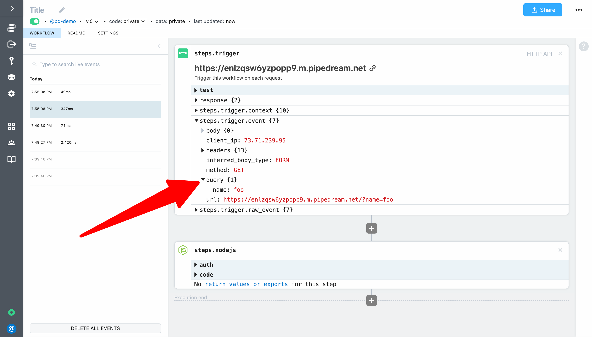

Next, let's modify our custom response to use this data that was passed in our trigger event. Expand the code section of your code step if it's collapsed. Then modify the value for the `body` parameter in the `$respond()` function. Change the double quotes around `hello world!` to backticks to convert it to a template literal. Then, replace `world` with `${steps.trigger.event.query.name}` to reference the value we're passing as the query data:

```javas
await $respond({
  status: 200,
  immediate: true,
  body: `hello ${steps.trigger.event.query.name}!`
})
```


Next, click the **Deploy** button, and then reload the previous URL:


Your workflow will now return `hello foo!` instead of `hello world!`. You can change the value you're passing for the name to test further.

### Make an HTTP request from a workflow

So far, we've focused on catching inbound HTTP requests and manipulating the response. Next, let's review how easy it is to make an outbound HTTP request from a workflow. 

For this example, we'll continue to modify the same workflow as in the previous examples. Click on the **+** sign between the trigger and code steps to bring up the menu to add a step.

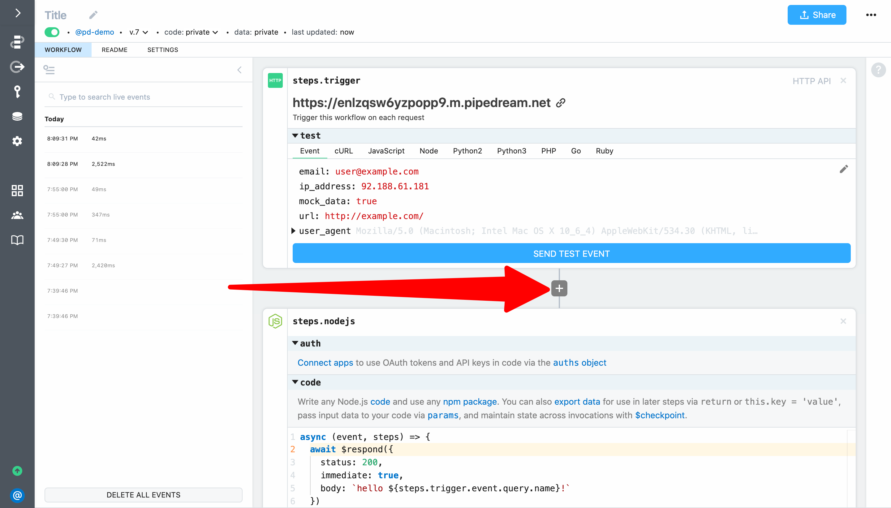

Next, click on the **HTTP / Webhook** app:


Then select **GET Request** (to make an HTTP GET request):

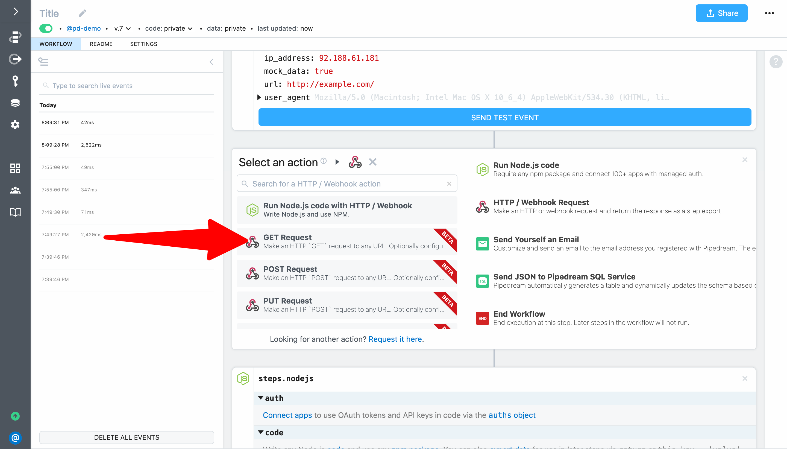

Next, enter `http://api.open-notify.org/iss-now.json` as the URL. This URL is a free API provided by http://open-notify.org  to return the current position of the International Space Station (ISS). It does not require any authentication to use it.


Finally, click **Deploy** and then hit the **Send Test Event** button in the trigger to run the workflow so we can test our change.


Select the event that's generated on the in the event list to inspect the execution. The response from the URL is exported from the step as `$return_value` and can be inspected and referenced in future steps. Expand the `iss_position` key to see the `lattitude` and `longitude` returned by the API. If you run the workflow again, you'll see the position change for each execution


Next, let's update the code step with our custom response and replace `hello ${steps.trigger.event.query.name}!` with the `lattitude` and `longitude` returned by the API. To do that, we'll set body to `steps.get_request.$return_value.iss_position` (with no quotes or backticks):

```javascript
await $respond({
  status: 200,
  immediate: true,
  body: steps.get_request.$return_value.iss_position
})
```


Finally, click **Deploy** and then reload the URL in your web browser.`hello foo!` should be replaced by the JSON representing the ISS position. Each time you load the URL, the updated position will be returned.


### Using npm packages

Next, let's replace the **GET request** action with a code step that uses the `axios` npm package. The result of the workflow will be the same, but this will introduce you to the pattern for using npm packages in code steps.

First, delete the **GET request** step from your workflow by clicking the **X** buttton at the top right of the step.


Next, click the **+** button and add another Node.js code step (select the **Run Node.js code** option in the right column of the step selector). Your workflow should look like this:


Next, let's `require` the `axios` npm package — there's no `npm install` or `package.json` required. Pipedream will automatically install any npm packages you `require`. The first line of code in the step should look like this:

```javascript
const axios = require('axios')
```

Next, let's make a `GET` request to the open-notify.org API to get the latest position of the ISS (when writing code, remember to `await` all promises):

```javascript
const response = await axios({
  method: "GET",
  url: "http://api.open-notify.org/iss-now.json"
})
```

Finally, let's `return` the data from the API to export it from the step (only exported data can be inspected in the builder and be referenced in later workflow steps). The data we want to export is in the `data` key of the the `axios` response:

```javascript
return response.data
```

Following is the complete code:

```javascript
const axios = require('axios')

const response = await axios({
  method: "GET",
  url: "http://api.open-notify.org/iss-now.json"
})

return response.data
```

Finally, let's rename our step from `steps.nodejs_1` to `steps.get_request` so we don't need to modify the last step of our workflow. Your workflow should now look like this:

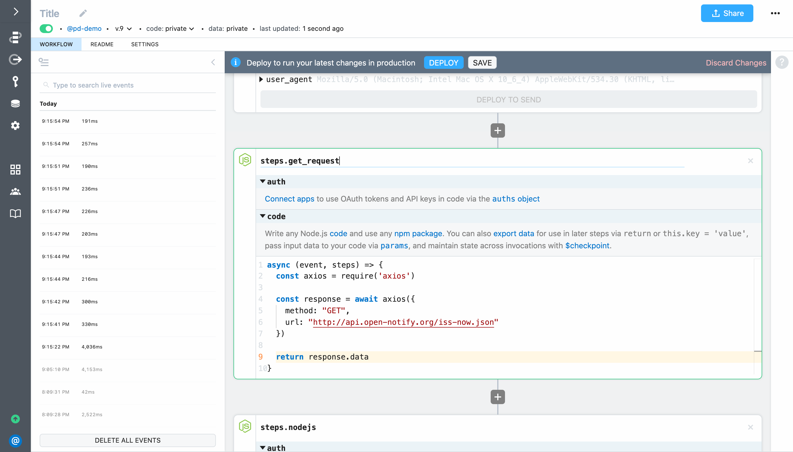

Next, click the **Deploy** button, and then load the endpoint URL in your browser again. You should continue to see the ISS position returned. Next, return to your workflow and select the event that corresponds with your most recent test. You should see your `steps.get_request` code step output the same result as the **GET Request** action you just replaced.


When you're done with this quickstart, test out other popular npm packages like `moment`, `loadash`, `luxon` and more!

### Email yourself on new items in an RSS feed

For the next example, create a new workflow and search for the **RSS** app

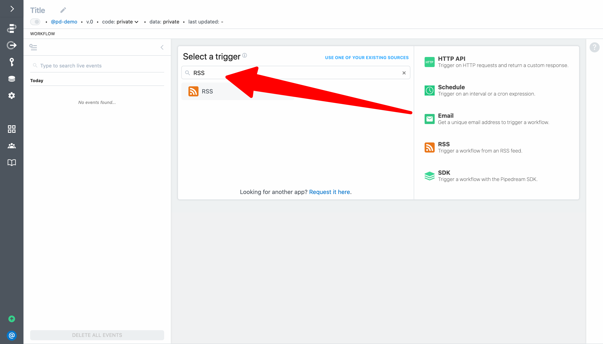

Click on **RSS** and thenselect the **New item in feed** trigger:


For this example, let's use the feed of CNN's top stories. Add `http://rss.cnn.com/rss/cnn_topstories.rss` as the **Feed URL**. You can optionally customize the **Timer** (it controls how often to check for new items in the feed) and the **Name**. 

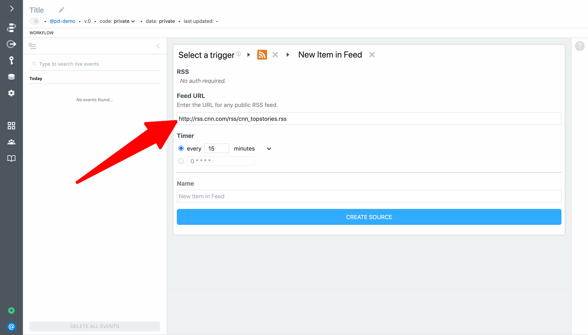 

Next, click **Create Source**. Pipedream will instantiate the source and retrieve recent items from the RSS feed. You can use these events to help you build your workflow (you can expand the drop down menu to select a different event to help you build your workflow).

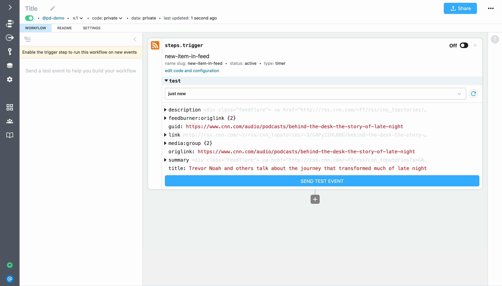

Next, click **Send Test Event** to export the event for the trigger.


Next, select the **Send Yourself an Email** action from the step selection menu.

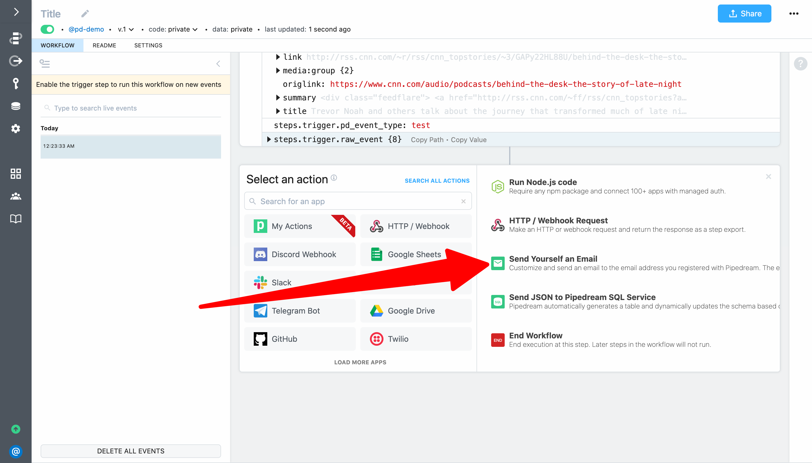

To configure the action:

- Set **Subject** to `New Item in Feed: {{steps.trigger.event.title}}`
- Set **Text** to `{{steps.trigger.event.description}}`
- Add the optional **Html** field and set it to `{{steps.trigger.event.description}}`


Finally, click **Deploy** and click **Send Test Event** in the trigger again to run the workflow.


Pipedream will send an email to the email address registered for your Pipedream account:


Finally, to automatically run the workflow whenever a new item is detected in the RSS feed, enable the trigger.


You can make any requests to this URL (using any HTTP method). 

1. Copy the endpoint URL generated by Pipedream (you can click to link icon to the right of the endpoint to copy to the clipboard)
2. Open https://hurl.it in a separate tab
3. Change the method to `POST` and enter URL in the **Destination** field
4. Click **Add Body** and enter `{ "data": "hello world!" }` as the value
5. Complete the captcha and click **Launch Request**

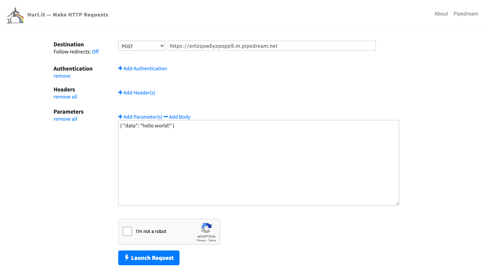

