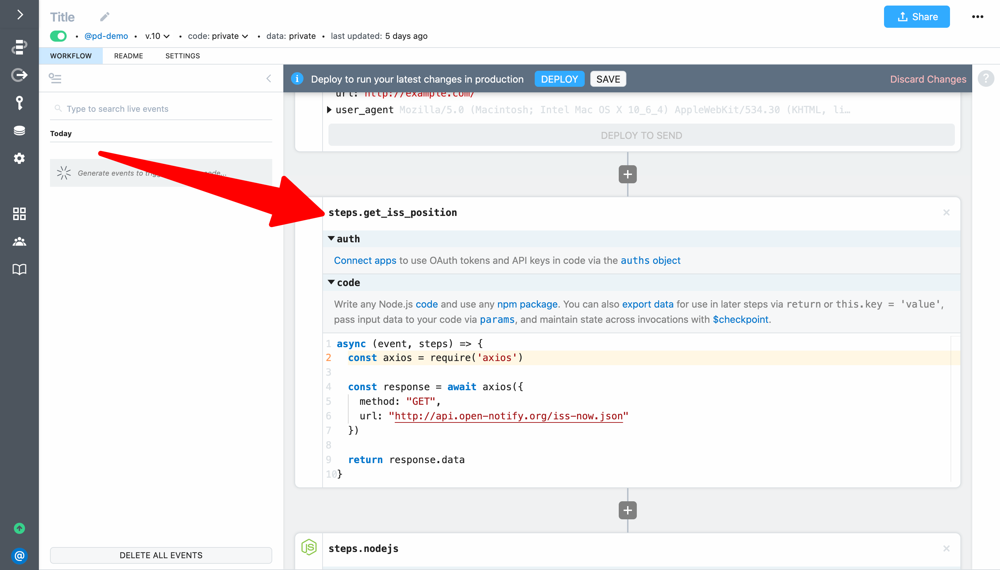
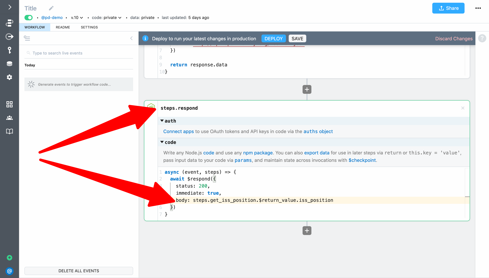
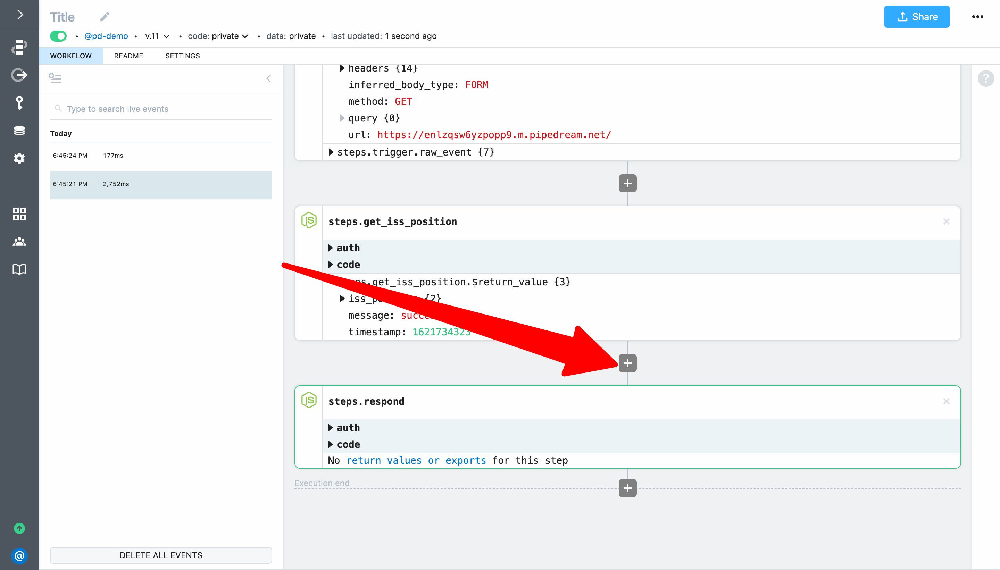
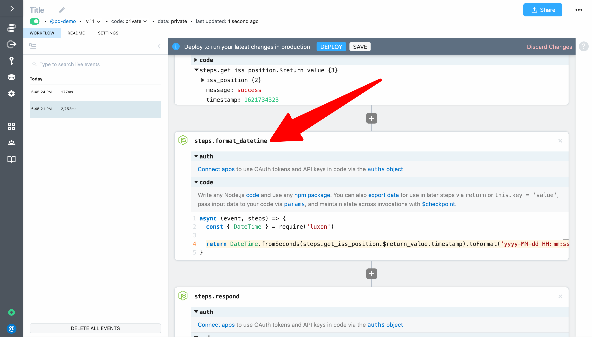
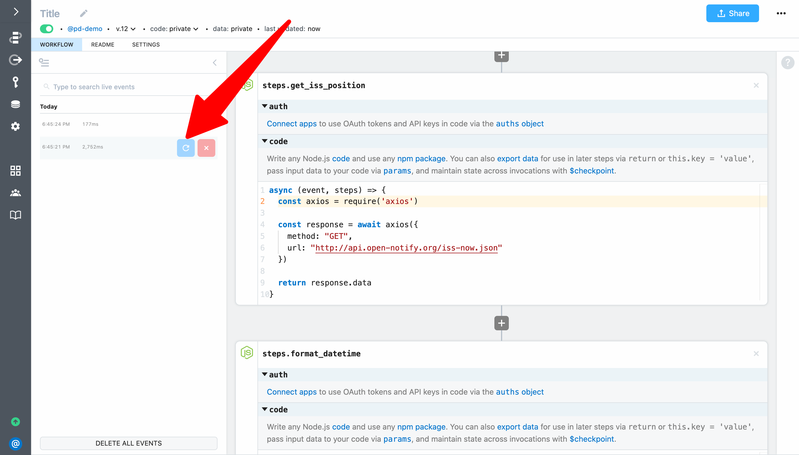
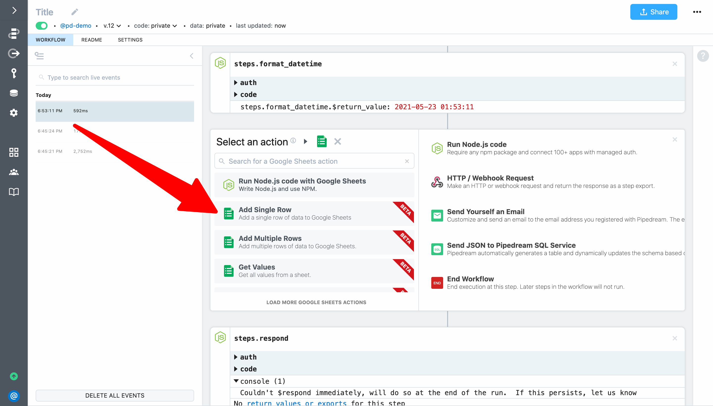
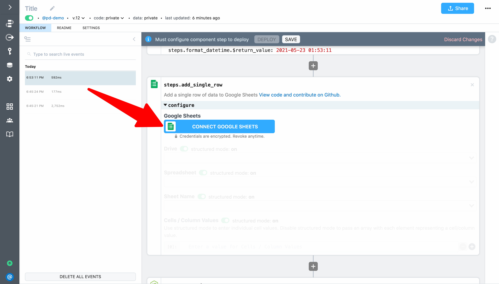
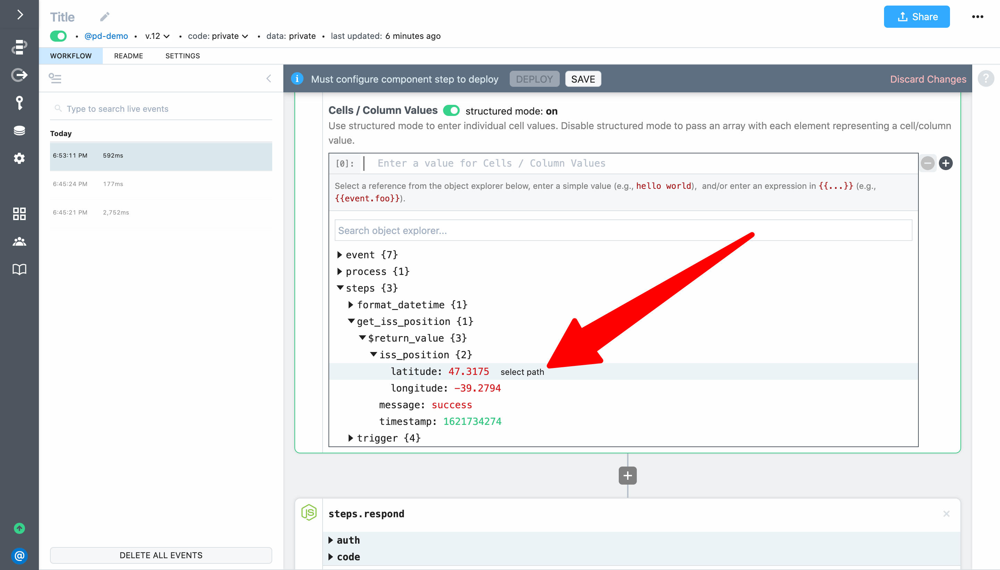
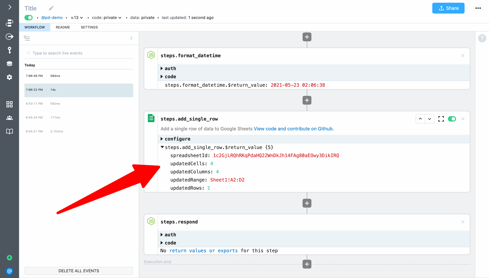

# Insert data into Google Sheets

For the next example, we'll:

1. Retrieve the position of the International Space Station (ISS) on each HTTP request
2. Convert the timestamp corresponding to the position data to a Google Sheets compatible date and time using the `luxon` npm package
3. Save the data for each workflow execution to a new row in Google Sheets

First, create a Google Sheet with the labels `Latitude`, `Longitude`, `Timestamp`, `Date`, and `Time` in the first row:

  

Before we continue, let's go ahead and change the names of our last two steps to better reflect their purpose. First, change `steps.get_request` to `steps.get_iss_position`:



Then, change `steps.nodejs` to `steps.respond`. You also need to update the code in this step that references `steps.get_request.$return_value.iss_position` to `steps.get_iss_position.$return_value.iss_position`.



Then click **Deploy** and make a request to your workflow endpoint to validate your changes. 

Looking at the result for `steps.get_iss_position`, we can see that the `timestamp` field returned by the API is not a friendly, human-readable date/time. 


Since we want to save this data to Google Sheets, let's use the `luxon` npm package to generate one. Based on a quick Google Search, the datetime format expected by Google Sheets is `yyyy-MM-dd HH:mm:ss`. 

Click the **+** button to add a new step after `steps.get_iss_position` and select **Run Node.js code**. 



Then add the following code to convert the timestamp to a Google Sheets compatible date/time and export it from the code step:

```javascript
const { DateTime } = require('luxon')

return DateTime.fromSeconds(steps.get_iss_position.$return_value.timestamp).toFormat('yyyy-MM-dd HH:mm:ss');
```

Let's also go ahead and change the name of the code step to `steps.format_datetime`



**Deploy** your changes. To run a test, either make another to the endpoint URL or click the **Replay Event** button. 



Select the most recent event and you should see a human-readable date/time as the return value for `steps.format_datetime`.


Next click the **+** button to add a new step after `steps.format_datetime` and select the **Google Sheets** app:


Select the **Add Single Row** action:



To configure the step, first connect your Google Sheets account. When you click on **Connect Google Sheets** Pipedream will open a popup window where you can sign in to connect your account. When you, Pipdream will secure store an OAuth token that allows actions to make API requests on your behalf (uou can also use these tokens yourself to authenticate API requests for your authenticated apps in code steps):



When prompted by Google, allow Pipedream access:


Next, select your **Drive**, **Spreadsheet** and **Sheet Name** from the drop down menus.


Then let's configure the cells / column values. First, we'll use the object explorer to select a value. The object explorer is automatically loaded whenever you focus in an action input. You can expand any item and then select the reference you want to insert.



Another option is to explore the exports for a step and click on the **Copy Path** link. Then paste the reference into the action input.


The final option is to use autocomplete — add double braces `{{ }}` and start typing between them to get autocomplete the same way you do in code steps. 


Since we want to add four columns of data with the latitude, longitude, timestamp and the formatted date time (in that order), your fully configured step should look like this:


Next, **Deploy** your changes and reload your endpoint URL. Your workflow should execute successfully:



When you view the response returned from the workflow, you should see the latest position of the ISS:


When you check Google Sheets you should see the values entered in the sheet. If you loaded the URL in your web browser, you'll actually see two events. We'll fix that in the next example.


