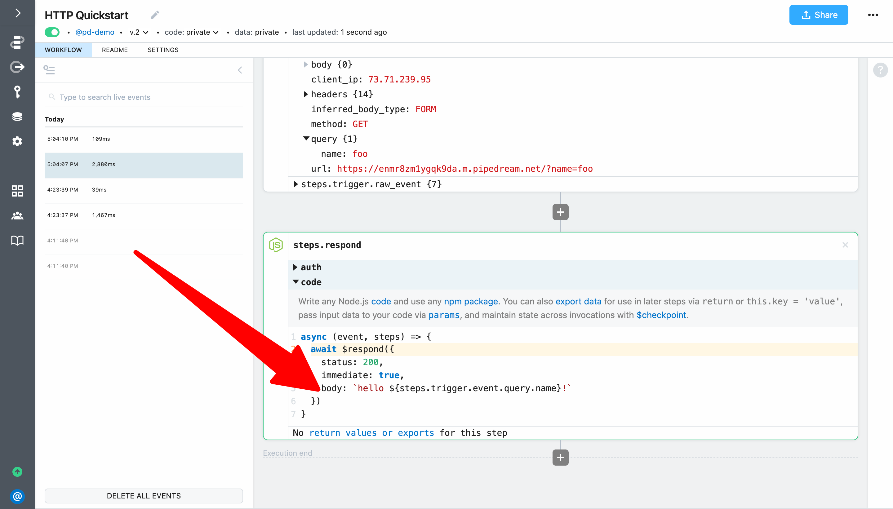

# hello ${name}!

Next, let's pass a name in each HTTP request and return it in the workflow response. This example builds on the workflow we created in [hello world!](/quickstart/hello-world/) and will cover how to:

[[toc]]

### Pass data to an HTTP triggered workflow via query parameters

First, modify the endpoint URL you loaded in your browser to trigger your workflow and add `?name=foo` to the end (e.g., `https://ENDPOINT-ID.m.pipedream.net/?name=foo`). Then load it to make another request to your workflow. You should still see `hello world!` returned as the response from your workflow.


### Inspect the query data sent to the workflow

Return to Pipedream and select the event you just generated from the event list. You should now see `{1}` next to the `query` field indicating it has nested values. Expand it to inspect the query parameter and value for the request. 


::: tip
If you don't see any query data, check the `url` parameter in the `steps.trigger.event` observation to make sure you didn't select the event associated with the browser's `favicon.ico` request.
:::

### Customize the HTTP response using data sent to the workflow

Next, let's incorporate this data into the workflow response. Expand the code section of `steps.nodejs` if it's collapsed. Then modify the value for the `body` parameter of the `$respond()` function and replace `world` with `${steps.trigger.event.query.name}` to reference the name we're passing to the trigger:

```javascript
await $respond({
  status: 200,
  immediate: true,
  body: `hello ${steps.trigger.event.query.name}!`
})
```



Finally, **Deploy** and reload the URL in your browser:


Your workflow will now return `hello foo!` (or whatever value you pass to `name`) instead of `hello world!`.

**Next, let's add an action to make an HTTP request from this workflow.** [Take me to the next example &rarr;](../make-http-request/) 
