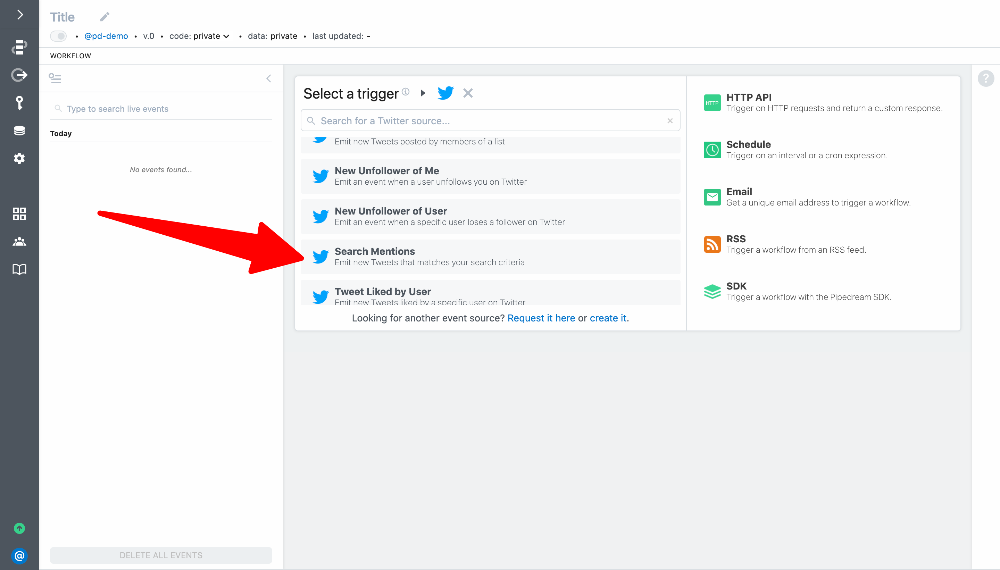
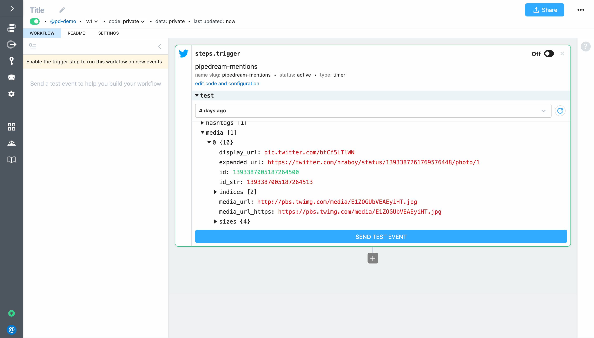
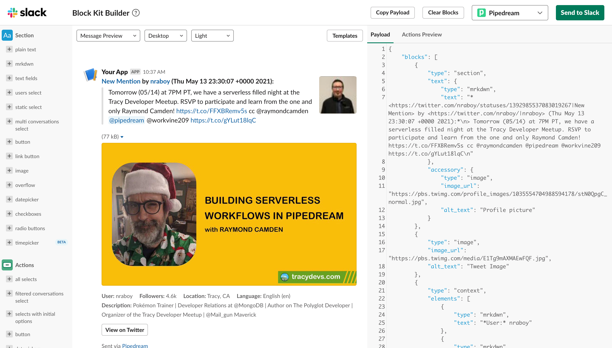
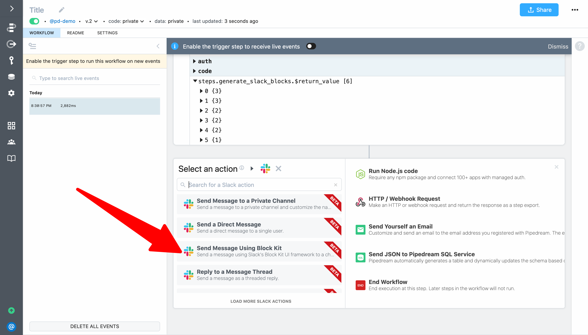
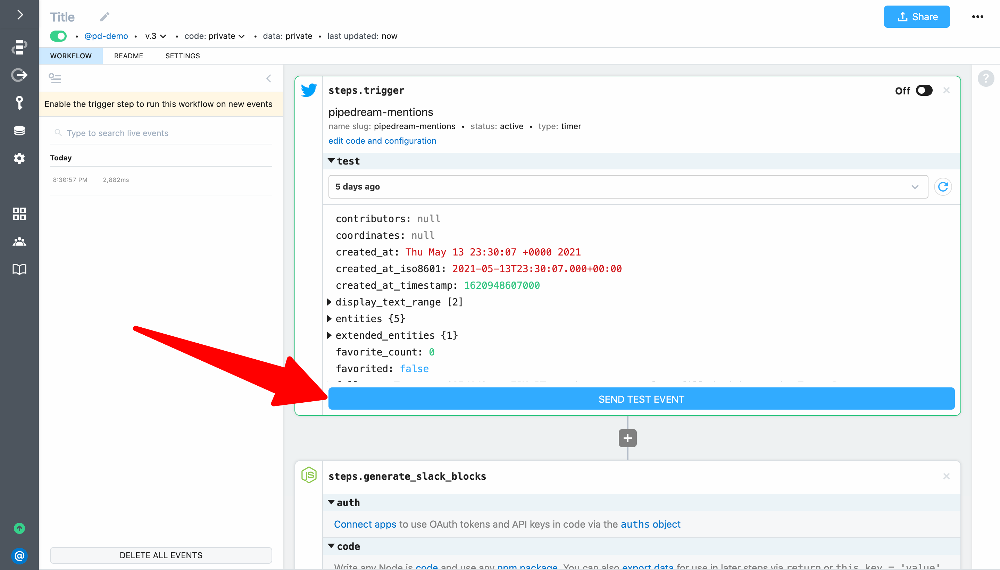
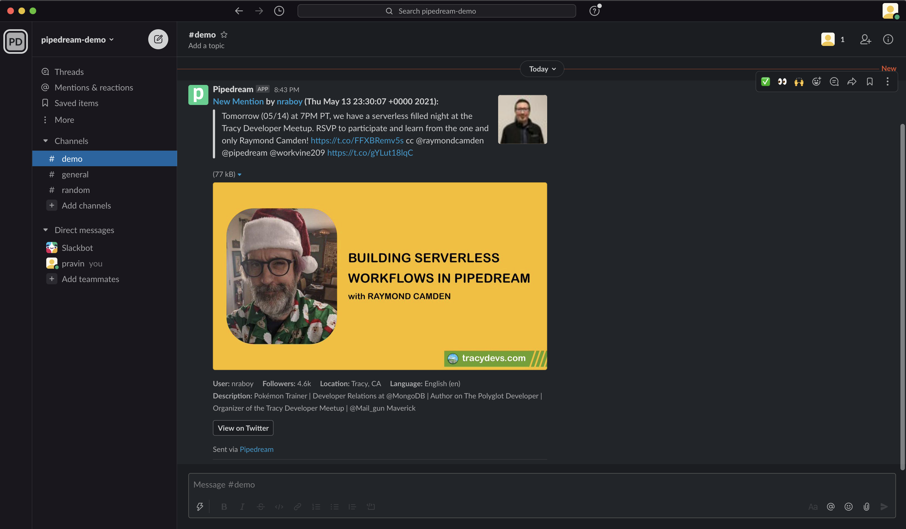
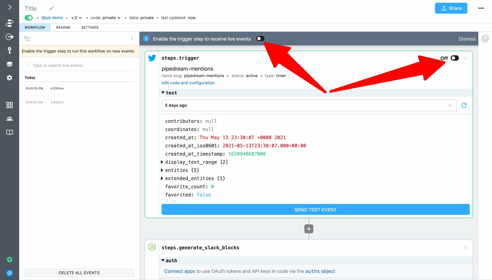

# Real-world Twitter -> Slack

For the last example in this quickstart, we'll use many of the patterns covered in earlier examples to solve a real-world use case.

- Trigger a workflow anytime [`@pipedream`](https://twitter.com/pipedream) is mentioned on Twitter
- Use Node.js and npm to format a message using Slack Block Kit
- Use an action to post the message exported from our code step to Slack

Following is an example of a Tweet that we'll richly format and post to Slack:


First, create a new workflow and select the **Twitter** app:


Select **Search Mentions** to trigger your workflow every time a new Tweet matches your search criteria:



Connect your Twitter account and then enter `@pipedream` for the search term. This will trigger your workflow when Pipedream's handle is mentioned on Twitter.


To complete the trigger setup, add an optional name (e.g., `Pipedream Mentions`) and click **Create Source**:


Use the drop down menu to select the event to help you build your workflow. Here we've selected a recent Tweet that includes an image (so we can incorporate that into our Slack message).



Based on a review of the event, we want to include the following data in our Slack message:

- Tweet text
- Tweet Language
- Tweet Type (Original Tweet, Reply, Retweet)
- Tweet URL
- Image (if present in the Tweet)
- Tweet timestamp
- Screen name and profile picture of the user
- Metadata for the user (number of followers, location and description)
- Link to the workflow that generated the Slack message (so it's easy to get to if we need to make changes in the future)

Let's use Slack's Block Kit Builder to create a [JSON message template with placeholder values](https://app.slack.com/block-kit-builder/TD5JFTFRQ#%7B%22blocks%22:%5B%7B%22type%22:%22section%22,%22text%22:%7B%22type%22:%22mrkdwn%22,%22text%22:%22*%3Chttps://twitter.com/nraboy/statuses/1392985537083019267%7CNew%20Mention%3E%20by%20%3Chttps://twitter.com/nraboy/%7Cnraboy%3E%20(Thu%20May%2013%2023:30:07%20+0000%202021):*%5Cn%3E%20Tomorrow%20(05/14)%20at%207PM%20PT,%20we%20have%20a%20serverless%20filled%20night%20at%20the%20Tracy%20Developer%20Meetup.%20RSVP%20to%20participate%20and%20learn%20from%20the%20one%20and%20only%20Raymond%20Camden!%20https://t.co/FFXBRemv5s%20cc%20@raymondcamden%20@pipedream%20@workvine209%20https://t.co/gYLut18lqC%5Cn%22%7D,%22accessory%22:%7B%22type%22:%22image%22,%22image_url%22:%22https://pbs.twimg.com/profile_images/1035554704988594178/stN0QpgC_normal.jpg%22,%22alt_text%22:%22Profile%20picture%22%7D%7D,%7B%22type%22:%22image%22,%22image_url%22:%22https://pbs.twimg.com/media/E1Tg9mAXMAEwFQF.jpg%22,%22alt_text%22:%22Tweet%20Image%22%7D,%7B%22type%22:%22context%22,%22elements%22:%5B%7B%22type%22:%22mrkdwn%22,%22text%22:%22*User:*%20nraboy%22%7D,%7B%22type%22:%22mrkdwn%22,%22text%22:%22*Followers:*%204.6k%22%7D,%7B%22type%22:%22mrkdwn%22,%22text%22:%22*Location:*%20Tracy,%20CA%22%7D,%7B%22type%22:%22mrkdwn%22,%22text%22:%22*Language:*%20English%20(en)%22%7D,%7B%22type%22:%22mrkdwn%22,%22text%22:%22*Description:*%20Pok%C3%A9mon%20Trainer%20%7C%20Developer%20Relations%20at%20@MongoDB%20%7C%20Author%20on%20The%20Polyglot%20Developer%20%7C%20Organizer%20of%20the%20Tracy%20Developer%20Meetup%20%7C%20@Mail_gun%20Maverick%22%7D%5D%7D,%7B%22type%22:%22actions%22,%22elements%22:%5B%7B%22type%22:%22button%22,%22text%22:%7B%22type%22:%22plain_text%22,%22text%22:%22View%20on%20Twitter%22,%22emoji%22:true%7D,%22url%22:%22https://twitter.com/nraboy/statuses/1392985537083019267%22%7D%5D%7D,%7B%22type%22:%22context%22,%22elements%22:%5B%7B%22type%22:%22mrkdwn%22,%22text%22:%22Sent%20via%20%3Chttps://pipedream.com/@/p_OKCYGM3%7CPipedream%3E%22%7D%5D%7D,%7B%22type%22:%22divider%22%7D%5D%7D). Next, we'll use a code step to replace the placeholder values with dynamic references to the event data that triggers the workflow.  



The action we will use accepts the array of blocks, so we'll extract that and export a populated array from our code step (i.e., we don't need to generate the entire JSON payload).

Add a step to **Run Node.js code** and name it `steps.generate_slack_blocks`. 


Next, let's add the npm packages we need — we'll use the `iso-639-1`  package to convert the language code provided by Twitter into a human readable name, and we'll use `lodash` to help with value extraction.

```javascript
const ISO6391 = require('iso-639-1')
const _ = require('lodash') 
```

Next, let's define functions that we'll use. First, add a function to generate the language name or return `Unknown`:

```javascript
// Return a friendly language name for ISO language codes
function getLanguageName(isocode) {
  try { return ISO6391.getName(isocode) } 
	catch (err) { return 'Unknown' }
}
```

Next, let's add a function to format the number of followers for a user (we can reuse this function we found via Google search on [Stack Overflow](https://stackoverflow.com/questions/9461621/format-a-number-as-2-5k-if-a-thousand-or-more-otherwise-900)).

```javascript
// Format numbers over 1000
function kFormatter(num) {
    return Math.abs(num) > 999 ? Math.sign(num)*((Math.abs(num)/1000).toFixed(1)) + 'k' : Math.sign(num)*Math.abs(num)
}
```

Next, let's format the Tweet text `steps.trigger.event.full_text` using Slack's quote formatting. Since Tweets can contain line breaks, we'll handing that as well:

```javascript
// Format the Tweet as a quoted Slack message
let quotedMessage = ''
steps.trigger.event.full_text.split('\n').forEach(line => quotedMessage = quotedMessage + '> ' + line + '\n' )

```

Next, let's extract some values to make our message generation easier:

```javascript
// Define metadata to include in the Slack message
const tweetUrl = `https://twitter.com/${steps.trigger.event.user.screen_name}/statuses/${steps.trigger.event.id_str}`
const userUrl = `https://twitter.com/${steps.trigger.event.user.screen_name}/`
const mediaUrl = _.get(steps, 'trigger.event.extended_entities.media[0].media_url_https', '')
const mediaType = _.get(steps, 'trigger.event.extended_entities.media[0].type', '')
```

Then, we'll start building the Slack Blocks:

```javascript
// Format the message as Slack blocks
// https://api.slack.com/block-kit
const blocks = []
blocks.push({
	"type": "section",
	"text": {
		"type": "mrkdwn",
		"text": `*<${tweetUrl}|New Mention> by <${userUrl}|${steps.trigger.event.user.screen_name}> (${steps.trigger.event.created_at}):*\n${quotedMessage}`
	},
		"accessory": {
			"type": "image",
			"image_url": steps.trigger.event.user.profile_image_url_https,
			"alt_text": "Profile picture"
		}
})
```

Next, if the Tweet contains a photo we'll add it to the message:

```javascript
if(mediaUrl !== '' && mediaType === 'photo') {
	blocks.push({
		"type": "image",
		"image_url": mediaUrl,
		"alt_text": "Tweet Image"
	})
}
```

Next, we'll populate the data in the message context elements...

```javascript
blocks.push({
	"type": "context",
	"elements": [
		{
			"type": "mrkdwn",
			"text": `*User:* ${steps.trigger.event.user.screen_name}`
		},
		{
			"type": "mrkdwn",
			"text": `*Followers:* ${kFormatter(steps.trigger.event.user.followers_count)}`
		},
		{
			"type": "mrkdwn",
			"text": `*Location:* ${steps.trigger.event.user.location}`
		},
		{
			"type": "mrkdwn",
			"text": `*Language:* ${getLanguageName(steps.trigger.event.lang)} (${steps.trigger.event.lang})`
		},
		{
			"type": "mrkdwn",
			"text": `*Description:* ${steps.trigger.event.user.description}`
		}
	]
},
```

...add the Tweet URL to the action button...

```javascript
{
	"type": "actions",
	"elements": [
		{
			"type": "button",
			"text": {
				"type": "plain_text",
				"text": "View on Twitter",
				"emoji": true
			},
			"url": tweetUrl
		}
	]
},
```

...and add the workflow ID by referencing `steps.trigger.context.workflow_id`:

```javascript
{
	"type": "context",
	"elements": [
		{
			"type": "mrkdwn",
			"text": `Sent via <https://pipedream.com/@/${steps.trigger.context.workflow_id}|Pipedream>`
		}
	]
},
{
	"type": "divider"
})
```

Finally, we'll return the array we assigned to `blocks`:

```javascript
return blocks
```

Here is the final, complete code:

```javascript
const ISO6391 = require('iso-639-1')
const _ = require('lodash') 

// Return a friendly language name for ISO language codes
function getLanguageName(isocode) {
  try { return ISO6391.getName(isocode) } 
	catch (err) { return 'Unknown' }
}

// Format numbers over 1000
function kFormatter(num) {
    return Math.abs(num) > 999 ? Math.sign(num)*((Math.abs(num)/1000).toFixed(1)) + 'k' : Math.sign(num)*Math.abs(num)
}

// Format the Tweet as a quoted Slack message
let quotedMessage = ''
steps.trigger.event.full_text.split('\n').forEach(line => quotedMessage = quotedMessage + '> ' + line + '\n' )

// Define metadata to include in the Slack message
const tweetUrl = `https://twitter.com/${steps.trigger.event.user.screen_name}/statuses/${steps.trigger.event.id_str}`
const userUrl = `https://twitter.com/${steps.trigger.event.user.screen_name}/`
const mediaUrl = _.get(steps, 'trigger.event.extended_entities.media[0].media_url_https', '')
const mediaType = _.get(steps, 'trigger.event.extended_entities.media[0].type', '')

// Format the message as Slack blocks
// https://api.slack.com/block-kit
const blocks = []
blocks.push({
	"type": "section",
	"text": {
		"type": "mrkdwn",
		"text": `*<${tweetUrl}|New Mention> by <${userUrl}|${steps.trigger.event.user.screen_name}> (${steps.trigger.event.created_at}):*\n${quotedMessage}`
	},
		"accessory": {
			"type": "image",
			"image_url": steps.trigger.event.user.profile_image_url_https,
			"alt_text": "Profile picture"
		}
})

if(mediaUrl !== '' && mediaType === 'photo') {
	blocks.push({
		"type": "image",
		"image_url": mediaUrl,
		"alt_text": "Tweet Image"
	})
}

blocks.push({
	"type": "context",
	"elements": [
		{
			"type": "mrkdwn",
			"text": `*User:* ${steps.trigger.event.user.screen_name}`
		},
		{
			"type": "mrkdwn",
			"text": `*Followers:* ${kFormatter(steps.trigger.event.user.followers_count)}`
		},
		{
			"type": "mrkdwn",
			"text": `*Location:* ${steps.trigger.event.user.location}`
		},
		{
			"type": "mrkdwn",
			"text": `*Language:* ${getLanguageName(steps.trigger.event.lang)} (${steps.trigger.event.lang})`
		},
		{
			"type": "mrkdwn",
			"text": `*Description:* ${steps.trigger.event.user.description}`
		}
	]
},
{
	"type": "actions",
	"elements": [
		{
			"type": "button",
			"text": {
				"type": "plain_text",
				"text": "View on Twitter",
				"emoji": true
			},
			"url": tweetUrl
		}
	]
},
{
	"type": "context",
	"elements": [
		{
			"type": "mrkdwn",
			"text": `Sent via <https://pipedream.com/@/${steps.trigger.context.workflow_id}|Pipedream>`
		}
	]
},
{
	"type": "divider"
})

return blocks
```

**Deploy** your workflow and send a test event. It should execute successfully and `steps.generate_slack_blocks` should return an array of Slack Blocks with 6 elements:


Next, click **+** to add a step and select the **Slack** app:


Then, scroll or search to find the **Send Message Using Block Kit** action:



Configure the step:


Then **Deploy** and send a test event to your workflow.



A formatted message should be posted to Slack:



Finally, turn on your trigger to run it on every event emitted by the source:



To test out your workflow, post a Tweet mentioning `@pipedream` — or [use our pre-written Tweet](https://twitter.com/intent/tweet?text=I%20just%20completed%20the%20%40pipedream%20quickstart%20https%3A%2F%2Fpipedream.com%2Fquickstart).


Your workflow will be triggered the next time your trigger runs (every 15 minutes by default, but you can manage your source and customize the interval from https://pipedream.com/sources/).