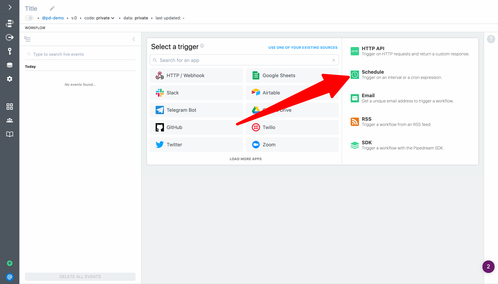
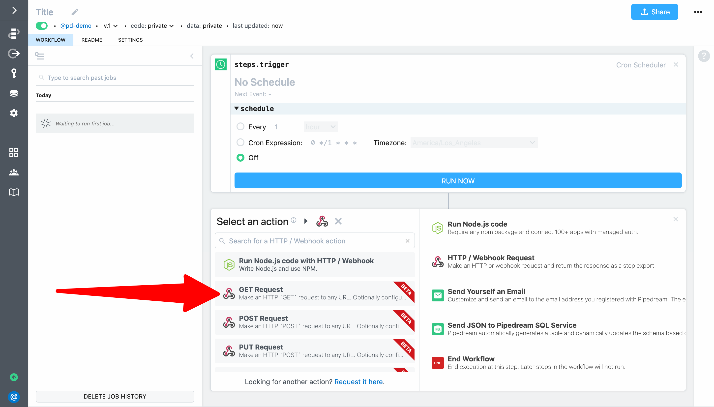
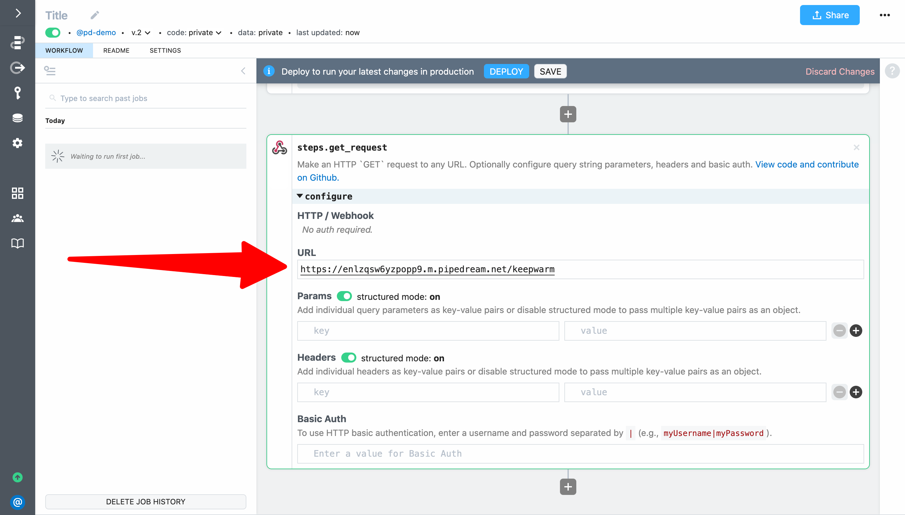
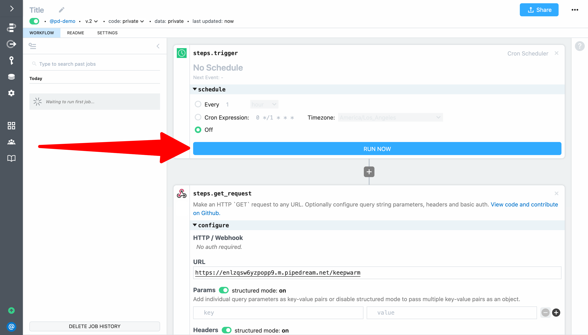
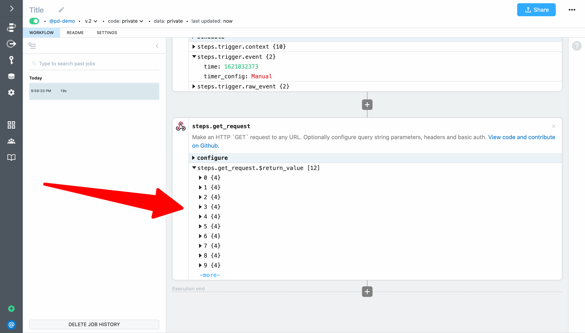
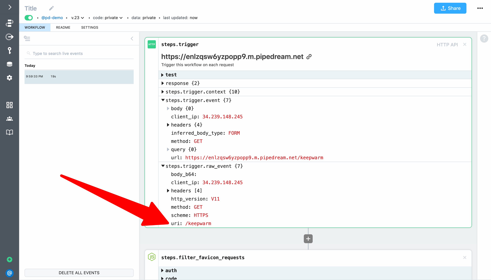
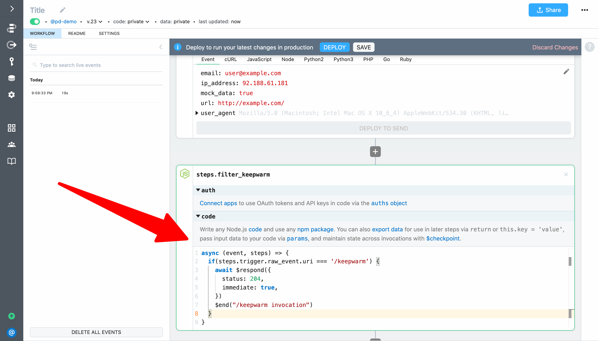
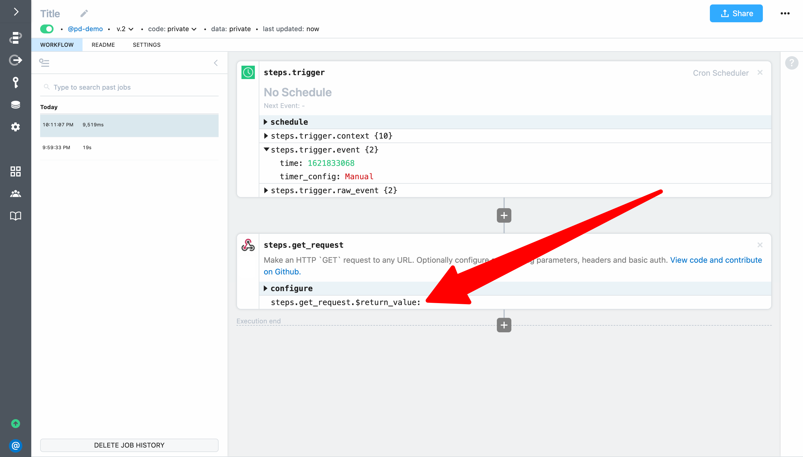
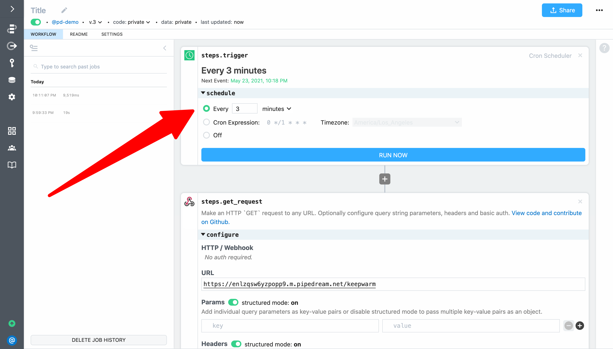

# Run workflow on a schedule

Next, let run a workflow on a schedule to keep our HTTP triggered workflow warm.

This example will take  **2 - 3 minutes** and will cover how to:

1. Create a workflow using the schedule trigger
2. Run a scheduled workflow manually to test it
3. Configure a schedule

For context, it's common for serverless functions that have not been recently invoked to go "cold". "Cold" functions take about 500 milliseconds longer to run than "warm" functions. To keep our HTTP workflow warm, let's invoke it every 3 minutes. 

First, create a new workflow and select the **Schedule** trigger:



Next, add a step, select the **HTTP / Webhook** app and the **GET Request** action.



Enter the endpoint URL for the workflow we built in the previous examples and add `/keepwarm` to the path. For example, the unique endpoint for the workflow in the screenshots is `https://enlzqsw6yzpopp9.m.pipedream.net`, so the URL we'll configure in the action is `https://enlzqsw6yzpopp9.m.pipedream.net/keepwarm` (**you should enter the endpoint URL unique to your workflow**).



 Next, **Deploy** and then click **Run Now** to test your workflow.



When it runs, you'll notice that our target workflow returned an array of objects. That means it ran end-to-end, including saving the latest ISS position to Google Sheets:



However, we don't want that to happen on our `/keepwarm` invocations. Let's fix that by adding a `$end()` statement to the target workflow. If we return to our HTTP triggered workflow, select the most recent event and expand `steps.trigger.raw_event`, we can see that the `uri` for the request is `/keepwarm`. 



Let's use that field for our filter. When requests are made to the `/keepwarm` path, we'll respond with an HTTP `204` no content response, and end the workflow invocation.

```javascript
if(steps.trigger.raw_event.uri === '/keepwarm') {
  await $respond({
    status: 204,
    immediate: true,
  })
  $end("/keepwarm invocation")
}
```

Here is the step in the workflow named `steps.filter_keepwarm` immediately after the trigger step:



**Deploy** the HTTP workflow, return to the scheduled workflow and click **Run Now** again. This time, no content was returned from `steps.get_request`:



And viewing the HTTP triggered workflow shows that the workflow execution was ended at `steps.filter_keepwarm`:


Finally, return to the scheduled workflow, schedule it to run on an inverval of every 3 minutes, and **Deploy** to update the workflow:



That's it — your scheduled workflow will now run every 3 minutes — 24 hours a day, 7 days a week.

**Next, we'll introduce you to app triggers by creating a workflow to email us every time there is a new items in an RSS feed .** [Take me to the next example &rarr;](../email-yourself/) 
